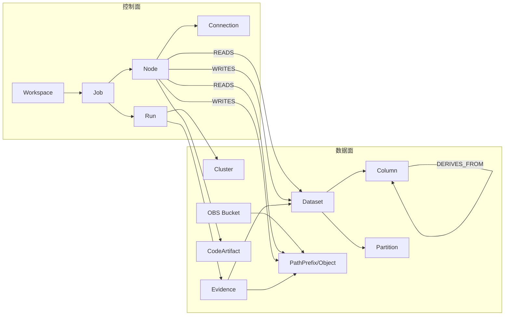
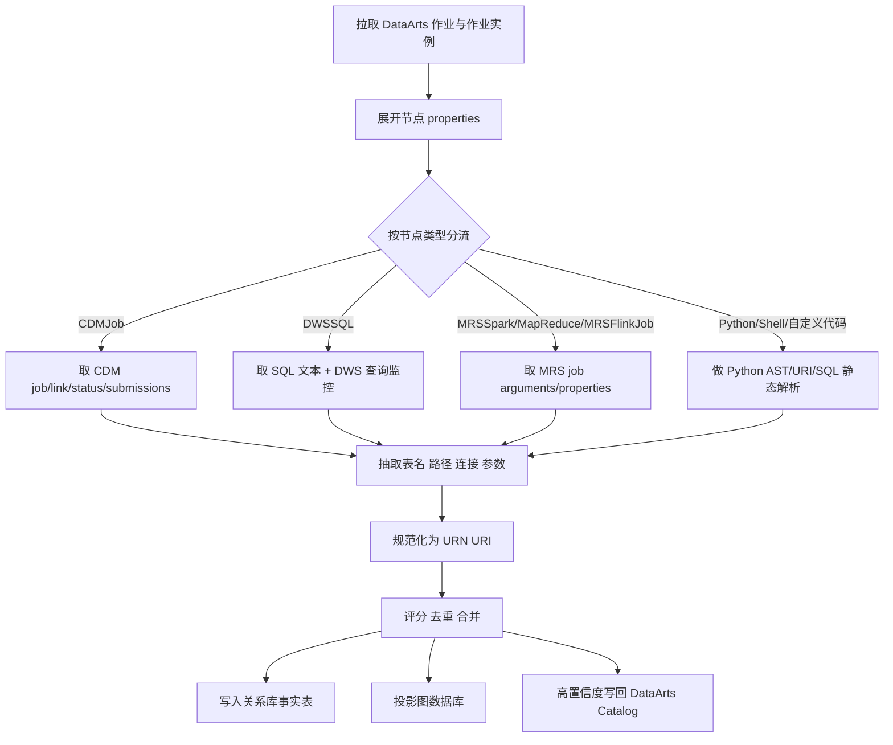

# 华为云 DGC 血缘功能不足评估与自研观测型血缘方案

## 执行摘要

华为云官方文档将平台统一命名为“数据治理中心 DataArts Studio”，本文将你所说的 DGC 视作这一官方产品语境下的数据治理与数据开发平台。基于公开文档，DataArts Studio 现有血缘能力更适合作为**目录侧、资产侧**的可视化能力，而不是跨 OBS、CDM、MRS、DWS、Python、Flink 作业的**事实级、运行级、证据级**血缘底座。原因不是它“完全没有血缘”，而是它的覆盖面、粒度、运行态观测与外部存储关联能力都存在明确边界。官方自动血缘目前主要覆盖 DLI SQL、DWS SQL、MRS Hive SQL、MRS Spark SQL、CDM Job、Data Migration 与 ETL Job；手动血缘虽能覆盖部分 SQL、MRS Spark、MRS Spark Python、OBS Manager 等节点，但手动配置不支持字段级血缘，而且一旦手动配置，对应节点的自动血缘解析会失效。官方还明确写到 CDM Job 血缘“不再演进”，单条 SQL 中含分号的场景也不支持自动解析。citeturn33search3turn41search2

更关键的是，DataArts Studio 的内建血缘查询接口本质上是以**资产 GUID** 为中心，返回 `guid_entity_map`、`relations` 和 `referred_entities`，并不天然具备以 **run_id / instance_id / query_id / app_id / external_id** 为核心的“运行证据视图”。而你当前的场景恰恰需要把 DataArts 作业定义、作业实例、CDM 迁移作业、MRS 提交作业、DWS SQL 监控、OBS 对象路径变化和 Python/Flink 代码里的外部存储引用统一到一张事实图上。官方同时提供了血缘写回接口，但另一个更偏批量导入的 DataMap 血缘导入接口仍处于“邀测”阶段，不适合作为核心依赖。citeturn34view2turn36view0turn34view0

因此，最合理的自研方向不是“替换 DataArts Catalog”，而是建设一套**观测优先的旁路血缘系统**：以 API 拉取和运行证据采集为主，以静态 SQL/Python/Flink 解析为补充，以规范化 URI/URN 为主键，以“原始 payload 留存 + 规范化图谱 + 高置信血缘写回 DataArts”三层架构落地。由于 DataArts 管理中心的数据库/schema/表/字段元数据获取接口已被官方标注为“待下线”，自研时更应把这些接口视作过渡性引导能力，而把直接访问 OBS、CDM、MRS、DWS 以及 DWS/MRS 内部系统目录与日志作为长期主路径。citeturn41search1turn42search2turn43search1turn37search6

## DGC 现有血缘功能的不足性评估

从官方能力边界看，DataArts Studio 的血缘方案本身并不弱，但它的设计中心是**“可管理的数据开发节点”**，不是**“任意跨服务运行链路”**。官方写明自动血缘主要靠系统解析数据开发作业中的数据处理和数据迁移节点；同时，支持自动解析的节点类型集中在 SQL 与少数迁移类节点，而不是任意 Python、Flink、外部程序、JAR、文件前缀和运行态事件。对你这种“数据定义在 DGC，执行横跨 OBS/CDM/MRS/DWS，代码又落在 Python/Flink 中”的环境，这意味着只依赖内建血缘，必然会出现链路断点。citeturn33search3turn48view0

尤其需要强调两点。第一，官方公开文档里，**MRSFlinkJob 节点**在作业定义 API 中是实际存在的，`singleNodeJobType` 对实时作业还明确列出了 `FlinkSQL` 与 `FlinkJar`；但官方血缘支持列表并没有把 MRS Flink 列入自动血缘或手动血缘支持清单。也就是说，至少在公开文档层面，Flink 作业的血缘覆盖**未被明确说明**。第二，Python 侧官方只在手动配置血缘清单中明确列出了 **MRS Spark Python**，而不是通用 Python 作业自动血缘。对“Python/Flink 自定义读取 OBS、拼 SQL、再写 DWS/MRS”的主流工程化模式，内建血缘无法形成可审计的完整事实链。citeturn48view0turn33search3

现有血缘还有三个现实问题。其一，手动血缘不支持字段级解析，意味着一旦你需要列级影响分析，靠人工补录无法落地。其二，官方写明“CDM Job 血缘不再演进，后续以 Data Migration 为主”，这意味着你当前若仍大量使用 CDM，继续等待内建能力补齐并不现实。其三，DataArts 在使用 MRS API 连接时，手动配置血缘最多展示 1000 张表，这对中大型 Hive 数仓并不够。citeturn33search3

下表把“痛点—官方边界—自研应对”对应起来。

| 痛点 | 官方现状 | 直接影响 | 自研应对 |
|---|---|---|---|
| SQL 以外节点覆盖不足 | 自动血缘主要覆盖 DLI SQL、DWS SQL、MRS Hive SQL、MRS Spark SQL、CDM Job、Data Migration、ETL Job；手动支持范围更广，但仍非全覆盖 | Python/Flink/JAR/文件复制/外部程序链路断裂 | 以作业定义 API + 运行实例 + 代码静态解析补齐 |
| 手动血缘无法列级 | 官方明确“手动配置血缘当前暂不支持字段级血缘解析” | 影响分析、列口径追溯无法精确到字段 | 列级血缘只接受 SQL AST、Spark/Flink 计划、明确映射证据生成 |
| CDM 血缘停止演进 | 官方明确“CDM Job 血缘不再演进” | 历史上大量 CDM 作业的血缘长期残缺 | 把 CDM 作业/API 作为一等采集源，长期旁路接管 |
| MRS API 连接展示上限 | 官方说明使用 MRS API 连接时最多展示 1000 张表 | Hive 大库下手工配血缘不可用 | 用 MRS/Hive 元数据与自研目录镜像替代 UI 选表 |
| Flink 文档支持不清 | 作业开发 API 中有 MRSFlinkJob/FlinkSQL/FlinkJar，但血缘支持文档未列出 | Flink 是事实存在的节点类型，却没有公开确认的血缘覆盖 | 把 Flink 视为自研优先级最高的补洞对象 |
| 自动 SQL 解析有限制 | 单条 SQL 不支持 SQL 中含分号场景 | 一条脚本里含复杂语句块时，官方自动解析易失效 | 分句、容错解析、多引擎 AST 与运行计划联合 |
| 运行态视图缺失 | 官方 ShowLineage 以资产 GUID 为中心，而不是 run_id/query_id/app_id | 无法做“某次补数/某次失败/某天回灌”链路审计 | 自建 run-centric evidence graph，保留设计态和运行态两个时间轴 |

表中“官方现状”依据：citeturn33search3turn48view0turn34view2

## 自研应抓取的元数据平面与官方 API 矩阵

### 认证与调用原则

除 OBS 以外，本报告涉及的 DataArts Studio、CDM、MRS、DWS 官方 API 文档都采用同一类项目级 API 认证模式：先通过 IAM 的“获取用户 Token”接口拿到响应头 `X-Subject-Token`，再把它放入各服务请求头 `X-Auth-Token`。华为云同时提供 AK/SK 签名方式与签名 SDK；OBS 的 REST API 调用前尤其要求先计算 API 签名，或直接使用 OBS SDK。对自研血缘系统，建议控制面 API 一律走 IAM Token 或 SDK 凭证；OBS 对象面优先用官方 SDK，避免自己维护签名细节。citeturn11search2turn25view0turn25view3turn44view0turn15search0turn19search1turn20search0turn20search1

DataArts Studio 还有一个很容易踩坑的差异：大多数数据开发、管理中心和数据目录 API 使用 `workspace` 请求头，但 DataMap 血缘导入接口要求的是 `instance` 请求头。自研采集器必须把 **project_id / workspace_id / instance_id / region / service endpoint** 拆开管理，而不能假设一个统一头域适用于所有接口。citeturn34view0turn34view1turn34view2

### 各服务元数据存储位置与必抓接口

| 服务 | 元数据真实落点 | 推荐必抓接口或查询 | 认证与关键请求头 | 最低必抓字段 | 备注 |
|---|---|---|---|---|---|
| DataArts Studio 作业开发 | DataArts 作业定义、节点属性、调度定义、作业实例、节点实例日志路径 | `GET /v1/{project_id}/jobs`；`GET /v1/{project_id}/jobs/{job_name}`；`GET /v1/{project_id}/jobs/instances/detail`；`GET /v1/{project_id}/jobs/{job_name}/instances/{instance_id}` | `X-Auth-Token`，多实例场景需 `workspace` | 作业级：`name`、`processType`、`id`、`createTime`、`directory`、`version`、`logPath`、`downstreamJobs`；节点级：`nodes[].name`、`type`、`preNodeName`、`conditions`、`properties`；实例级：`instanceId`、`status`、`planTime`、`startTime`、`endTime`、`executeTime`、`instanceType`、`submitTime`、`errorMessage`；节点实例级：`nodeName`、`type`、`status`、`queue`、`retryTimes`、`inputRowCount`、`speed`、`logPath` | `ListJobs` 单次最多返回 1000 条；`ListJobInstances` 查询时间窗口不超过 7 天，必须做持续归档 |
| DataArts Studio 管理中心 | 数据连接定义、连接配置、数据源元数据镜像 | `GET /v1/{project_id}/data-connections/{data_connection_id}`；`GET /v2/{project_id}/{connection_id}/databases`；`GET /v2/{project_id}/{connection_id}/schemas`；`GET /v2/{project_id}/{connection_id}/datatables`；`GET /v2/{project_id}/{connection_id}/datatables/{table_id}/columns` | `X-Auth-Token` + `workspace` | 连接级：`dw_name`、`dw_type`、`dw_config`、`dw_category`、`create_user`、`create_time`、`agent_id`；数据库级：`database_name`、`description`；表级：`table_id`、`table_name`、`dw_id`、`dw_name`、`dw_type`、`database_name`、`schema_name`、`life_cycle`、`description`、`create_time`、`table_size`、`partitioned`；字段级：`column_name`、`column_type`、`comment`、`seq_number`、`primary`、`partition_col` | `schemas / datatables / columns` 在官方文档中已标记“待下线”，只能作为辅助引导，不能当长期唯一依赖 |
| DataArts Studio 数据目录/血缘 | 资产 GUID、目录实体、关系边、手工/导入血缘 | `GET /v3/{project_id}/entities/{guid}/lineage`；`POST /v1/{project_id}/lineage/lineage-info`；可选 `POST /v1/{project_id}/datamap/lineage/import` | `X-Auth-Token` + `workspace`；DataMap 导入需 `instance` | 查询：`base_entity_guid`、`guid_entity_map`、`relations[].from_entity_id`、`relations[].to_entity_id`、`relations[].relationship_id`、`referred_entities`；写回：`connection_id`、`connection_name`、`job_id`、`node_name`、`table_lineage.input_tables`、`output_tables`、`column_lineages` | `ImportDataMapLineage` 仍为邀测，不适合作为核心依赖，应优先使用稳定的 `CreateLineageInfo` |
| CDM | 集群、连接 Link、作业定义、作业状态、执行历史 | `GET /v1.1/{project_id}/clusters/{cluster_id}/cdm/link/{link_name}`；`GET /v1.1/{project_id}/clusters/{cluster_id}/cdm/job/{job_name}`；`GET /v1.1/{project_id}/clusters/{cluster_id}/cdm/job/{job_name}/status`；`GET /v1.1/{project_id}/clusters/{cluster_id}/cdm/submissions?jname={job_name}` | `X-Auth-Token`，部分调用还要求集群上下文 | Link：`name`、`id`、`connector-name`、`creation-date`、`update-date`、`enabled`、`link-config-values.configs[].inputs[].name/value`；作业：`job_type`、`name`、`from-connector-name`、`to-connector-name`、`from-link-name`、`to-link-name`、`from-config-values`、`to-config-values`、`driver-config-values`、`external_id`、`rows_read`、`rows_written`、`files_read`、`files_written`、`status`；运行态：`submissions[].job-name`、`status`、`progress`、`creation-date`、`last-update-date`、`counters` | 官方明确 CDM API 为自研 API，且不建议大量小作业；查询类接口保守限流，必须按增量策略抓取 |
| OBS | 桶元数据、对象元数据、对象列表 | `GET /`（ListBuckets）；`HEAD /`（HeadBucket）；`GET /?prefix=...&marker=...`（ListObjects）；`HEAD /{object_key}`（HeadObject） | OBS API 签名或 SDK；IAM/桶策略授权 | Bucket：`Name`、`CreationDate`、`Location`、`BucketType`，以及 `x-obs-bucket-location`、`x-obs-storage-class`、`x-obs-version`、`x-obs-fs-file-interface`、`x-obs-epid`、`x-obs-az-redundancy`；Object：至少保留对象 key、前缀、大小、最后修改时间，以及 Head 返回的全部标准头和自定义元数据 | 单次最多返回 1000 个对象；不支持按时间排序定位对象，只能依赖前缀/marker 扫描 |
| MRS | 集群、节点、提交作业、SQL 执行、数据连接、HDFS 目录 | `GET /v2/{project_id}/clusters/{cluster_id}/job-executions/{job_execution_id}`；`GET /v2/{project_id}/data-connectors`；`ShowJobList` / `ExecuteSql` / `ShowSqlResult` / `ShowHdfsFileList` / `ListNodes`（接口名已公开，本次检索材料未完整展开 URI，记为“未明确说明”） | `X-Auth-Token` | 作业：`job_id`、`user`、`job_name`、`job_result`、`job_state`、`job_progress`、`job_type`、`started_time`、`submitted_time`、`finished_time`、`elapsed_time`、`queue`、`arguments`、`launcher_id`、`app_id`、`properties`；数据连接列表：至少抓取 `connector_id`、`source_type` 及全量返回体 | `arguments` 与 `properties` 是关联外部 JAR、OBS `s3a://` 路径、运行参数的关键证据 |
| DWS | 集群级控制面；表/列元数据在数据库系统视图；运行态在 SQL 监控 API | `GET /v1.0/{project_id}/clusters`；`GET /v1.0/{project_id}/clusters/{cluster_id}`；`POST /v2/{project_id}/clusters/{cluster_id}/dms/queries`；`ShowQueryDetail`（精确 URI 在本次检索摘要中未完整展开）；数据库侧：`SELECT * FROM PG_TABLES`、`SELECT * FROM DBA_TAB_COLUMNS WHERE schema='...'` | 集群 API 用 `X-Auth-Token`；库内目录查询用 JDBC/gsql 凭证 | 集群：`id`、`status`、`name`、`version`、`port`、`endpoints[].jdbc_url`、`public_endpoints[].jdbc_url`；SQL 监控：`query`、`query_id`、`db_name`、`query_band`、`job_name`、`job_inst`、`user_name`、`application_name`、`start_time`、`duration`、`resource_pool`、`query_plan`、`query_status`；表/列：表名、schema、列名、类型、注释 | DWS 管理 API 不直接替代库内系统目录；列级元数据更适合从系统视图/JDBC 获取 |

官方依据：citeturn46search0turn48view0turn47search1turn46search1turn40view3turn40view1turn41search1turn42search2turn43search1turn34view2turn36view0turn34view0turn25view3turn27view0turn27view1turn27view2turn25view1turn25view2turn22search1turn20search1turn19search1turn20search0turn44view0turn45view0turn45view2turn44view2turn15search0turn17search0turn15search1turn18search2

### 自研系统应优先抓取的“证据字段”

真正能让血缘系统“观察力强于内建血缘”的，不是只抓逻辑表名，而是把**定义态**、**运行态**、**资源态**、**证据态**四层字段一起抓下来。定义态用 `ShowJob.nodes[].properties`、CDM `ConfigValues.inputs[].name/value`、DWS 外表 `LOCATION`、MRS `arguments/properties` 定位读写对象；运行态用 DataArts `instanceId`、CDM `external_id/counters`、MRS `app_id/launcher_id`、DWS `query_id/query_band/application_name` 绑定一次具体运行；资源态用 OBS bucket/object、DWS JDBC URL、MRS cluster/data connector；证据态则保留 `logPath`、SQL 文本、Python 片段、Flink SQL、JAR URI、HDFS/OBS 路径字符串。这样才能做“这一跳到底来自作业定义、解析结果，还是运行时观察”的区分。citeturn48view0turn46search1turn25view1turn27view2turn45view2turn17search0turn16search1

### 推荐的 API 调用顺序

| 顺序 | 调用 | 目的 | 产出主键 |
|---|---|---|---|
| 采集开始 | IAM 获取用户 Token；OBS 可直接用 SDK/AK/SK 签名 | 统一认证 | `X-Auth-Token`、OBS credential |
| 遍历作业 | `GET /v1/{project_id}/jobs` | 枚举 DataArts 作业及最近实例状态 | `job_name`、`job_id` |
| 取作业定义 | `GET /v1/{project_id}/jobs/{job_name}` | 获取节点 DAG、依赖、属性、日志根路径 | `nodes[].name`、`nodes[].type` |
| 取运行实例 | `GET /v1/{project_id}/jobs/instances/detail?jobName=...` | 获取实例 ID、补数/手工调度等运行语义 | `instanceId`、`instanceType` |
| 取实例详情 | `GET /v1/{project_id}/jobs/{job_name}/instances/{instance_id}` | 把节点定义映射到节点运行结果和节点日志 | `nodeName`、`logPath` |
| 解析外部服务 | 视节点类型调用 CDM/MRS/DWS/OBS 接口 | 抽取查询、连接、路径、作业参数、真实 read/write 对象 | `external_id`、`app_id`、`query_id`、`obs://...` |
| 基线对比 | `GET /v3/{project_id}/entities/{guid}/lineage` | 与内建血缘做差分校验 | `guid` |
| 高置信写回 | `POST /v1/{project_id}/lineage/lineage-info` | 把表级/列级结果回灌 DataArts | `qualified_name` |

表中调用顺序与接口依据：citeturn46search0turn48view0turn47search1turn46search1turn25view0turn25view1turn25view2turn44view0turn17search0turn22search1turn34view2turn36view0

## 统一血缘数据模型与跨服务关联策略

自研血缘系统应该把“表血缘”升级为“**资产—算子—运行—证据**”四层统一模型。核心思想是：任何一条边都必须能回答四个问题——它是谁、发生在何时、证据来自哪里、置信度是多少。否则这个系统最终仍会沦为“画图工具”，而不是审计工具。DataArts 的 `ShowLineage` 返回的是资产 GUID 之间的关系，而 `CreateLineageInfo` 已经给出了你可以写回的最低公共交集：上游表、下游表、列级输入输出、连接与作业上下文。自研模型应把这组字段扩展成更运行化、更可验证的结构。citeturn34view2turn36view0

推荐采用**规范化 URI/URN** 作为全局主键。例如，OBS 统一为 `obs://bucket/path`；MRS 里若看到 `s3a://bucket/path`，在解析层做归一化映射到同一 OBS 资源；DWS 表统一为 `dws://cluster/database/schema/table`；Hive 表统一为 `hive://cluster/database/table`；DataArts 侧则保留 `workspace/job/node/instance` 的控制面主键。之所以必须这样做，是因为同一资源在不同服务中会以不同别名出现：DWS 外表 `LOCATION 'obs://...'`、MRS Spark `arguments` 中的 `s3a://...`、DataArts 节点 `logPath` 上的 `obs://...`、CDM `bucketName + inputDirectory` 都可能指向同一个物理对象域。citeturn16search1turn45view0turn46search1turn31view0

### 统一血缘模型表

| 类别 | 元素 | 建议主键 | 关键属性 | 说明 |
|---|---|---|---|---|
| 实体 | Workspace | `workspace_id` | region、project_id、instance_id、name | DataArts 工作空间或实例作用域 |
| 实体 | Connection | `service + connection_id` | name、type、config_hash、owner、agent_id | 管理中心连接或 CDM Link |
| 实体 | Cluster | `service + cluster_id` | name、version、endpoint、jdbc_url、queue/default_db | MRS / DWS 集群 |
| 实体 | Bucket | `obs://bucket` | region、bucket_type、storage_class、epid、az_redundancy | OBS 桶 |
| 实体 | PathPrefix | `scheme://bucket/path_prefix` | normalized_path、partition_pattern、wildcard | OBS/HDFS 路径或目录前缀 |
| 实体 | Dataset | `service://cluster-or-conn/database/schema/table` | catalog、database、schema、table、description、table_id | 表、视图、外表、Hive 表、DWS 表 |
| 实体 | Column | `dataset_urn + column_name` | type、comment、seq、is_pk、is_partition_col | 列级资产 |
| 实体 | Partition | `dataset_urn + partition_spec` | key_values、partition_path、event_date | 表分区或路径分区 |
| 实体 | Job | `workspace_id + job_id` | name、process_type、directory、version、owner | DataArts 作业定义 |
| 实体 | Node | `job_id + node_name` | type、pre_nodes、property_hash、conditions | 作业节点/算子 |
| 实体 | CodeArtifact | `sha256(content_or_uri)` | language、uri、embedded_sql、script_type | SQL、Python 脚本、JAR、Flink SQL、Shell |
| 实体 | Run | `service + run_id` | plan_time、start_time、end_time、status、instance_type | DataArts instance / CDM submission / MRS job / DWS query |
| 实体 | Evidence | `run_id + evidence_hash` | evidence_type、source_api、source_uri、raw_payload_ref | 原始证据指针 |
| 关系 | CONTAINS | `parent -> child` | observed_at | Workspace 包含 Job，Dataset 包含 Column 等 |
| 关系 | DEPENDS_ON | `node -> node` | condition_expr | 节点前后依赖 |
| 关系 | USES_CONNECTION | `node -> connection` | resolved_from、confidence | 节点使用哪个连接 |
| 关系 | EXECUTES_ON | `run -> cluster` | queue、resource_pool | 运行落在哪个集群或资源池 |
| 关系 | READS | `node/run -> dataset/path` | mode、predicate、sql_fragment、confidence | 读边 |
| 关系 | WRITES | `node/run -> dataset/path` | mode、overwrite_flag、confidence | 写边 |
| 关系 | DERIVES_FROM | `output_column -> input_column` | transform_expr、confidence | 列级血缘 |
| 关系 | OBSERVED_IN | `edge -> evidence` | evidence_weight | 边的证据来源 |
| 属性 | confidence_score | 边属性 | 0.0–1.0 | 1.0 为 API 明确血缘/确定性计划；0.6–0.8 为运行态或强解析；更低为弱规则推断 |
| 属性 | valid_time | 边属性 | effective_from/effective_to | 处理补数、回灌、迟到数据 |
| 属性 | observed_time | 边属性 | first_seen/last_seen | 处理重新跑批、重试与版本切换 |

### 实体关系示意图



### 跨服务关联规则

跨服务关联至少要做五件事。第一，**统一名称解析**：DWS/RDS 用 `database + schema + table`，Hive 用 `database + table`，OBS 用 `bucket + path`，CDM 用 `link_name + config-values`，DataArts 用 `connection_id/name + node.properties`。第二，**统一 URI**：把 `obs://`、`s3a://`、必要时 `hdfs://` 映射成可比较的规范路径。第三，**统一运行主键**：DataArts `instanceId`、CDM `external_id`、MRS `job_id/app_id/launcher_id`、DWS `query_id` 必须都落到 `Run`。第四，**统一时间语义**：至少保存 `plan_time`、`start_time`、`end_time`、`observed_at`。第五，**统一证据权重**：目录 API 返回的关系、确定性 SQL AST、Spark/Flink Explain、运行日志命中、文件路径正则推断，其可信度必须有序。citeturn47search1turn25view1turn45view0turn17search0turn34view2turn36view0

## Python、Flink 与外部存储血缘提取方法

### Python 作业

Python 血缘不要只靠正则。官方 Python 文档说明 `ast` 模块可以生成 Python 抽象语法树，能让程序以编程方式处理 Python 语法结构；Python 语言服务文档也明确给出了配套的 token、tokenize、symtable 等模块。对于自研血缘，这足以支持你做**两阶段解析**：先用 `ast.parse()` 做结构化遍历，抓 `import`、函数调用、字符串字面量、f-string、with/open、SQL 执行函数、Spark/Hive/Flink 客户端构造；再用轻量数据流分析追踪变量，把字符串拼出来，最后对其中的 SQL 和 `obs:// / s3a:// / hdfs://` URI 再做二次解析。这样比单纯从日志里抠字符串稳定得多。citeturn49search0turn49search12

在 Python 里，建议把以下模式设为一级规则：数据库客户端的 `execute/query/sql` 调用；SparkSession / HiveContext / Trino/Presto 风格的 `sql(...)`；文件读写调用；对象存储 SDK 调用；配置文件读取；字符串模板或 Jinja/format/f-string 生成的表名与路径。对确实无法静态还原的动态 SQL，再退回运行日志和目标系统观察补证。这个顺序很重要：**先静态，后运行；先强证据，后弱推断**。对于拼接 SQL，推荐结合 SQLGlot 做方言感知 AST 解析；其官方文档说明该库支持多种 SQL 方言，并内置 lineage API，可把 AST 进一步展开成列级依赖图。citeturn49search7turn49search3turn49search11

### Flink 作业

Flink 侧要分成 **Flink SQL** 与 **Flink Jar/程序式作业** 两条路线。官方 Flink SQL 文档说明 Flink SQL 支持 `CREATE TABLE`、`CREATE VIEW`、`CREATE FUNCTION`、`INSERT`、`EXPLAIN`、`SHOW` 等语句；Flink 的 EXPLAIN 文档又明确它可以输出执行建议与计划信息。对血缘系统来说，这意味着 Flink SQL 不应该只按脚本文本做静态解析，还应该在可行条件下把 `EXPLAIN` 的输出存为证据，补齐 connector、catalog、source table、sink table、UDF、临时视图与 statement set 关系。citeturn49search1turn49search9

程序式 Flink 则需要从三层取证。第一层是 **DataArts Job/Node 定义**，因为官方 `ShowJob` 已明示实时单任务类型存在 `FlinkSQL` 与 `FlinkJar`，节点类型也包含 `MRSFlinkJob`；第二层是 **MRS 作业运行态**，至少抓 `job_id`、`job_name`、`arguments`、`app_id`、`launcher_id`、`properties`；第三层是 **程序参数与 JAR 配置**，解析其中的 URI、表名、catalog、DDL、connector 参数。若作业通过 MRS 提交，`arguments` 与 `properties` 往往是你找到 JAR、主类、运行参数、外部路径和集群队列的最佳入口。citeturn48view0turn46search1turn44view0turn45view0turn45view2

### Spark、Hive、SQL 与文件系统模式

Spark 和 Hive 的列级血缘不应只依赖“脚本名”。Spark 官方文档说明 Spark SQL/DataFrame 会在逻辑计划与物理计划层面表达结构化数据处理；`EXPLAIN` 与 `DataFrame.explain()` 都能输出分析后的逻辑计划、优化逻辑计划和物理计划。对自研血缘系统，这意味着你完全可以把 Spark SQL、DataFrame API、临时视图、CTE、Insert Overwrite 等统一收束到“解析 SQL AST + 可选 Explain 计划”这一条主线上。Hive SQL 则沿用相同框架，只是方言与 catalog 解析规则不同。citeturn49search10turn49search2turn49search6turn33search3

对于外部文件系统，建议按“**路径规格化 + 分区模式识别 + 读写意图识别**”处理。DWS 外表文档明确演示了 `LOCATION 'obs://bucket/path'` 这样的 OBS 外表定义；MRS Spark 作业示例则直接在 `arguments` 中出现 `s3a://obs-test/jobs/...jar`。因此同一条物理对象路径，可能分别出现在 DWS SQL、MRS 参数、DataArts 节点日志、CDM `bucketName + inputDirectory` 中。路径标准化层必须把这些都映射成一套统一资源 URI，然后再由上层图谱决定它是“对象集合”“分区前缀”还是“某次运行中的具体对象”。citeturn16search1turn45view0turn31view0turn46search1

### 提取流程图



### 采集与解析伪代码

```python
def harvest_workspace(project_id, workspace_id, time_window):
    jobs = list_jobs(project_id, workspace_id)
    for job in jobs:
        job_def = show_job(project_id, workspace_id, job["name"])
        insts = list_job_instances(project_id, workspace_id, job["name"], time_window)

        for inst in insts:
            inst_detail = show_job_instance(
                project_id, workspace_id, job["name"], inst["instanceId"]
            )

            for node in job_def["nodes"]:
                node_props = kv_pairs(node.get("properties", []))
                runtime_node = find_runtime_node(inst_detail["nodes"], node["name"])

                evidence = []
                edges = []

                if node["type"] == "CDMJob":
                    cdm_job_name = resolve_cdm_job_name(node_props)
                    cdm_job = cdm_show_job(cdm_job_name)
                    cdm_status = cdm_show_status(cdm_job_name)
                    evidence += [cdm_job, cdm_status]
                    edges += parse_cdm_configs(cdm_job)

                elif node["type"] in {"DWSSQL", "HiveSQL", "SparkSQL", "DLISQL"}:
                    sql_text = extract_sql(node_props, runtime_node)
                    evidence += [sql_text]
                    edges += parse_sql_with_dialect(sql_text)

                elif node["type"] in {"MRSSpark", "MapReduce", "MRSFlinkJob"}:
                    mrs_job_id = resolve_mrs_job_id(node_props, runtime_node)
                    mrs_job = mrs_show_single_job(mrs_job_id)
                    evidence += [mrs_job]
                    edges += parse_uris_and_sql(mrs_job["arguments"], mrs_job["properties"])

                else:
                    code_text = extract_embedded_code_or_script(node_props)
                    if looks_like_python(code_text):
                        py_facts = parse_python_ast(code_text)
                        evidence += [py_facts]
                        edges += py_facts.sql_edges + py_facts.uri_edges

                edges = normalize_uris_and_names(edges)
                edges = attach_run_context(edges, inst, runtime_node)
                edges = score_edges(edges, evidence)

                upsert_raw_evidence(evidence)
                upsert_entities_and_edges(job, node, inst, runtime_node, edges)

    diff_against_builtin_lineage()
    push_back_high_confidence_edges()
```

上面的逻辑不是官方示例代码，而是基于官方 API 字段边界整理的推荐采集框架。其关键前提是：**DataArts 节点属性必须全量保留，不要只抓白名单字段**，因为官方 `ShowJob` 文档明确不同节点类型对应不同的属性表，MRS Flink 也有独立属性定义，而本次检索材料并未完整展开所有类型字段名。citeturn48view0turn36view0turn49search0turn49search7turn49search1turn49search2

## 增量更新、可视化查询与治理控制

### 增量更新与补数处理

这类系统最怕两种“时间错觉”：一是以为对象存储能按时间高效扫描，二是以为作业实例永远可回看。OBS 官方明确写明单次 ListObjects 最多返回 1000 个对象，且**不支持通过时间排序找到某个时间上传的对象**，只能依赖前缀搜索；DataArts `ListJobInstances` 又把查询窗口限制在最多 7 天。实践上，这意味着你的采集器不能靠“全桶按时间扫一遍”或“需要时再回查历史实例”，而应该长期维护 **checkpoint**：对作业实例按 `maxPlanTime` 递增拉取，对 OBS 按业务分区前缀与 marker 持久化进度，对 DWS/MRS/CDM 则按作业更新时间、开始时间、提交时间递增拉取。citeturn19search1turn47search1

补数与回灌必须成为一等公民。DataArts 的作业实例列表和实例详情都显式返回 `instanceType`，其中 `5` 表示补数据；CDM 运行态有 `creation-date`、`last-update-date` 与 counters；MRS 作业有 `submitted_time/started_time/finished_time`；DWS 监控有 `query_start`、`duration` 等字段。建议所有边记录同时保存 `effective_time` 与 `observed_time`：前者代表“这次作业处理的业务时间”，后者代表“系统何时看到这条边”。这样即便后补 2026-05-01 的数据，也不会把图谱误写成“今天才生成上游”。citeturn46search1turn47search1turn25view1turn45view2turn17search0

### 图数据库与关系型存储的取舍

在没有预算约束的前提下，最稳妥的是**双写架构**：原始证据与规范化实体/边事实表落在关系型存储，交互式多跳追溯与影响分析走图投影层。关系层适合做审计、回放、CDC、版本管理、按时间切片；图层适合做 3 跳以上上游/下游、最短路径、爆炸半径与人的可视化浏览。DWS 已经提供 JDBC 入口、系统视图与 SQL 监控 API，本身非常适合作为关系侧的事实仓；图侧若不想额外引入独立图产品，也可以先在关系库里用边表 + 递归查询起步，再在热资产上做物化图缓存。是否引入专门图数据库，取决于交互延迟目标，而不是血缘采集本身。citeturn15search0turn17search0turn18search2

下面给出推荐模式。

| 存储层 | 建议内容 | 优点 | 弱点 | 适用 |
|---|---|---|---|---|
| 原始快照层 | 原始 API payload、日志摘录、SQL 文本、代码片段、对象列表快照 | 可追责、可重放、便于二次解析 | 容量大、查询不友好 | 证据留存 |
| 关系事实层 | `entities`、`edges`、`runs`、`evidence`、`snapshots`、`checkpoints` | 易做 CDC、审计、统计、版本比较 | 多跳路径查询一般 | 主存储 |
| 图投影层 | 热门实体、聚合边、前后 5 跳索引、影响范围缓存 | 浏览和分析体验好 | 需要同步维护 | 交互式检索 |

### 推荐的关系模式与查询接口

建议至少拆成以下几张核心表：`entity`、`edge`、`edge_evidence`、`run`、`job_node`、`connection_dim`、`resource_uri_dim`、`checkpoint_state`。其中 `edge` 以 `(src_urn, dst_urn, edge_type, run_scope, confidence_bucket)` 为自然键，再加上 `first_seen_at`、`last_seen_at`、`effective_from`、`effective_to`。`run` 则统一容纳 DataArts `instanceId`、CDM `external_id`、MRS `job_id/app_id`、DWS `query_id`。这样设计的好处是：一个表链路既能按设计态看，也能按运行态看，还能按补数批次看。citeturn47search1turn25view1turn45view0turn17search0

自研 REST API 建议至少提供四类接口：按资产查血缘、按运行查证据、按路径查消费者、按时间点回放。示例接口可以是 `GET /lineage/nodes/{urn}`、`GET /lineage/runs/{run_id}`、`GET /search?uri=obs://...`、`GET /impact/{urn}?depth=...&as_of=...`。如果你计划继续让业务方在 DataArts 目录里消费结果，那么系统内部 REST 只面向治理团队，面向终端用户的结果则优先通过 `CreateLineageInfo` 回灌到 DataArts Catalog。citeturn36view0turn34view2

### 示例查询

```cypher
MATCH p = (src)-[:READS|WRITES|DERIVES_FROM*1..4]->(dst {urn: $target_urn})
RETURN p
ORDER BY relationships(p)[-1].last_seen_at DESC
LIMIT 50;
```

```sql
SELECT src_urn,
       dst_urn,
       edge_type,
       confidence_score,
       last_seen_run_id,
       last_seen_at
FROM lineage_edge
WHERE dst_urn = :target_urn
ORDER BY last_seen_at DESC;
```

```http
GET /lineage/runs/{run_id}
GET /lineage/nodes/{urn}?direction=in&depth=5&as_of=2026-06-01T00:00:00Z
GET /lineage/search?uri=obs://bucket/path/prefix/
```

### UI/UX 建议

真正可用的血缘 UI 不应只显示一张图，而应同时展示**资产详情、最近运行、证据来源、置信度与时间切片**。建议主界面采用三栏：左侧是搜索与过滤，中间是图谱，右侧是证据面板。证据面板默认展示“这条边从哪里来”：是 SQL AST、DWS query、MRS job arguments、CDM config 还是 OBS 日志路径。没有证据的边不要默认展示为实线，应显示为虚线或低置信样式。

```text
┌────────────────────── 搜索 / 过滤 ──────────────────────┐
│ 资产 URN / 表名 / OBS 路径 / run_id / query_id         │
│ 时间窗  设计态↔运行态  只看高置信  只看补数             │
└────────────────────────────────────────────────────────┘
┌──────── 左侧资产树 ────────┬──────── 中央血缘画布 ────────┬──────── 右侧证据面板 ────────┐
│ DWS/public.fact_order      │ fact_order  ←  dwd_order    │ 边类型: READS                │
│ OBS://raw/order/dt=...     │    ↑             ↑          │ 证据: DWS query_id=...       │
│ MRS Hive/dwd_order         │ obs://raw/...  cdm_job_x    │ SQL: INSERT INTO ...         │
│ 最近运行                   │                             │ 运行: instanceId=...         │
└────────────────────────────┴─────────────────────────────┴──────────────────────────────┘
```

### 治理与安全影响

安全上最需要警惕的不是“API 能不能调”，而是**密钥和 SQL/代码里天然带着敏感信息**。CDM 的 OBS 连接参数官方直接包含 `accessKey/securityKey`；DWS 外表示例也显示了 `ACCESS_KEY/SECRET_ACCESS_KEY`；Huawei SDK 示例与文档多次提醒不要把 AK/SK 硬编码，而应密文化后放入配置文件或环境变量。自研血缘系统如果直接把这些字段明文入库，就会从治理系统变成新的敏感面。正确做法是：密钥类字段只做哈希或脱敏留痕，明文只在调用侧短时驻留；SQL 文本与代码片段分级存取，默认只向治理管理员开放原文。citeturn29search5turn16search1turn11search2turn24search4

权限最小化也必须按服务拆分。OBS 至少需要 `ListBucket/GetObject` 类权限；MRS 读取作业与数据连接分别对应 `mrs:cluster:getJob` 与 `mrs:dataConnector:listInstance`；DataArts、CDM、DWS 侧则应仅授予查询类接口所需的 API 权限，而不是直接用高权限账号。特别是 DWS 若用 `DBA_TAB_COLUMNS` 抓列元数据，官方文档说明该视图只有系统管理员可访问；如果无法满足，就应回退到更低权限的目录视图或由数据库管理员提供只读元数据账号。citeturn20search0turn19search1turn44view0turn44view2turn18search1

## 实施路线图、验证策略与风险优先级

### 实施路线图

| 阶段 | 目标 | 主要产出 | 预估工作量 |
|---|---|---|---|
| 发现与建模 | 统一命名、主键、采集边界、权限模型 | URN/URI 规范、字段字典、权限清单、PoC 范围 | 2–3 周 |
| 控制面采集 | 打通 DataArts 作业、实例、连接、目录基线 | DataArts/Catalog collector、原始 payload 落盘 | 3–4 周 |
| 数据面采集 | 打通 CDM、OBS、MRS、DWS | 四类 collector、checkpoint、限流器、重试器 | 4–6 周 |
| 解析与归一 | SQL/Python/Flink 解析、路径标准化、置信度评分 | parser pipeline、normalizer、dedupe engine | 4–6 周 |
| 存储与查询 | 落地关系层与图投影、查询 API、UI 原型 | schema、lineage API、前端原型 | 4–6 周 |
| 校验与写回 | 与内建血缘对比、人工验真、目录回写 | diff report、golden cases、DataArts write-back | 3–4 周 |
| 生产化 | 监控、告警、灰度、回滚、容量规划 | SLA、告警项、值班文档、运行手册 | 2–3 周 |

若团队规模为 4–6 人，且不受预算或运行环境限制，比较现实的完整周期大约是 4–6 个月。首个能用版本不需要一步到位做全量列级血缘；更务实的做法是先把**作业级 + 表级 + 运行证据级**做实，再逐步把 SQL/Spark/Flink 的列级覆盖补齐。

### 工具建议

华为云原生侧，建议把 **OBS** 作为原始快照与日志湖，**DWS** 作为关系事实仓和对账查询层，**DataArts Catalog API** 作为高置信结果的消费回写口，**IAM** 作为统一凭证与最小权限控制中心；若你们已有 MRS 资源，也可以把重型回放和大规模历史解析作业放到 MRS 跑。开源侧，至少建议固定采用 **Python `ast`** 做 Python 结构化解析，采用 **SQLGlot** 作为多方言 SQL AST 与 lineage 解析器；Spark/Flink 则优先利用引擎原生 `EXPLAIN` 作为运行计划证据，而不是重复造查询规划轮子。citeturn49search0turn49search12turn49search7turn49search3turn49search1turn49search9turn49search2turn49search6turn15search0turn36view0

### 验证与测试策略

验证不能只做“有没有图”，而要做“是不是事实”。推荐三层校验。第一层是**黄金样例**：挑选 20–30 条业务上已经明确的 DWS SQL、Hive SQL、CDM、MRS Spark、MRS Flink、Python 作业，人工标注正确上游/下游和列映射。第二层是**系统对比**：把自研结果与 `ShowLineage` 返回结果做差分，区分“官方有但自研没有”“自研有但官方没有”“两边都有但方向不同”。第三层是**运行态回放**：围绕 `instanceId`、`external_id`、`app_id`、`query_id` 做证据重建，看一条边是否至少能找到一个定义态或运行态证据支撑。citeturn34view2turn47search1turn25view1turn45view0turn17search0

还应加入几条机器可检查的图谱约束。例如：任何 `WRITES` 边必须有至少一个 `Run` 或 `CodeArtifact` 证据；任何列级 `DERIVES_FROM` 都必须挂靠到同一次作业节点或同一个 SQL 片段；补数据实例不得覆盖正常调度实例的 `effective_time`。如果约束不满足，边应降为低置信或进入人工审核队列，而不是直接写回 DataArts。citeturn36view0turn47search1

### 按优先级排序的风险与缓解措施

| 优先级 | 风险 | 影响 | 缓解措施 |
|---|---|---|---|
| P0 | 继续依赖 DataArts 内建血缘作为唯一事实来源 | Python/Flink/OBS 外部路径链路大量缺失，审计不可用 | 把内建血缘降级为“基线对照”，核心事实由旁路采集器生成 |
| P0 | 管理中心元数据获取接口“待下线” | 连接/表/字段镜像链路未来失效 | 直接采集 OBS/CDM/MRS/DWS；管理中心接口只做 bootstrap |
| P0 | OBS 不能按时间排序扫描对象 | 增量采集漏对象，晚到数据漏边 | 采用前缀分区扫描、marker checkpoint、业务日期分桶 |
| P0 | CDM 大量小作业导致控制面压力 | 采集器与业务都遭遇性能问题 | 合并采集窗口、批量扫描、减少高频轮询；对小作业治理 |
| P1 | Flink 公开血缘支持未明确说明 | 流批一体链路断档 | Flink 列为自研一期重点，统一走 MRSFlinkJob + EXPLAIN + jar 参数解析 |
| P1 | DWS 列元数据可能要求高权限视图 | 采集权限过高或拿不到列信息 | 优先用只读元数据账号；必要时由 DBA 提供受限视图 |
| P1 | AK/SK 在 CDM Link 或 DWS 外表定义中泄露 | 治理平台反成敏感面 | 所有密钥字段只保留脱敏/哈希，明文绝不落库 |
| P1 | 仅靠正则解析 Python/SQL/路径 | 误报与漏报都高 | 使用 AST/SQL parser/Explain 三种证据分层，正则只当兜底 |
| P2 | DataMap 批量血缘导入仍在邀测 | 写回路径不稳定 | 只用稳定的 `CreateLineageInfo`，邀测接口不入主流程 |
| P2 | 运行证据长期不归档 | 7 天窗口后无法审计历史实例 | 采集器常驻运行，按天归档 Run/Evidence 快照 |

风险依据：citeturn33search3turn41search1turn42search2turn43search1turn19search1turn30search4turn48view0turn20search0turn44view0turn16search1turn29search5turn34view0turn47search1

整体结论是明确的：**华为云 DGC 的现有血缘功能并非“不可用”，但它不足以覆盖你所描述的 OBS、CDM、MRS、DWS、Python、Flink 混合作业面，也不足以承担运行审计级事实基线。**最优解不是继续手工补血缘，而是建设一套观测优先的自研血缘平面，以 DataArts 作业与目录 API 为入口，以 CDM/MRS/DWS/OBS 为事实采集源，以 Python AST、SQLGlot、Spark/Flink Explain 为解析器，以关系事实仓 + 图投影为存储结构，再把高置信度表级/列级结果按需写回 DataArts Catalog。这样既能承接现有平台，又能真正解决“血缘不够、证据不强、运行不可追”的根痛。citeturn33search3turn34view2turn36view0turn41search1turn19search1turn45view0turn17search0